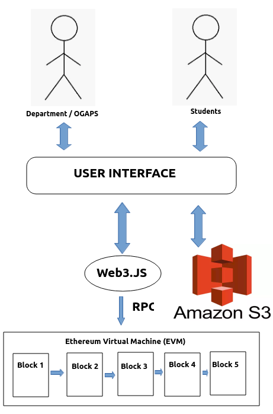
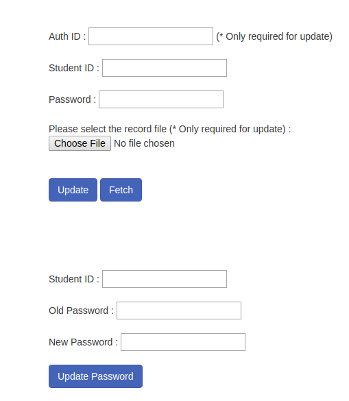

# Decentralized Howdy: A decentralized application for student record storage

## Architecture of the application

 
## Dependencies
* node
* [ganache-cli](https://nethereum.readthedocs.io/en/latest/ethereum-and-clients/ganache-cli/)
* web3@1.0.0-beta.37
* solc@0.5.3
* aws-sdk-2.283.1.min.js
* pdf.js
* jQuery

## Steps to run the application
1. Clone the repository using ``git clone https://github.com/phoenix1712/ehtereum_recrods_dapp.git``
2. Change the directory to ``ehtereum_recrods_dapp``.
3. Make sure you have necessary permissions. You can use ``chmod 777 `` This step may not be necessary.
4. Use the following command - ``npm install ganache-cli web3@1.0.0-beta.37`` in terminal to install necessary libraries.
5. In the same terminal, say **terminal-1**, execute the following command - ``node_modules/.bin/ganache-cli``. ganache-cli creates 10 test accounts for us automatically and shows their address. Each account is preloaded with 100(fake) ethers.
6. Open a new terminal, let's call it **terminal-2**, (do not close the current terminal) and change to ``ehtereum_recrods_dapp``. Execute the following command : ``npm install solc@0.5.3``
7. In **terminal-2** issue this command to compile the smart contract : ``node_modules/.bin/solcjs --bin --abi Record.sol``. This command generates two files : ``Record_sol_Record.bin`` - the bytecode and ``Record_sol_Record.abi`` - a binary interface of the contract that tells the contract user what methods are available in the contract.
8. Start the local node server in **terminal-2** by simply executing ``node``. Type the following lines of code to setup the environment
<pre>
Web3 = require('web3')
web3 = new Web3("http://localhost:8545")
web3.eth.getAccounts(console.log)
bytecode = fs.readFileSync('Record_sol_Record.bin').toString()
abi = JSON.parse(fs.readFileSync('Record_sol_Record.abi').toString())
deployedContract = new web3.eth.Contract(abi)
authIDs=['deptcse','ogapstamu']
deployedContract.deploy({
  data: bytecode,
  arguments: [authIDs.map(name => web3.utils.asciiToHex(name))]
}).send({
  from: '0x232183981a0bd076cf24e9c4081f4914a954e7b2',**PUT ONE OF THE ACCOUNT ADDRESS FROM terminal-1 here **
  gas: 1500000,
  gasPrice: web3.utils.toWei('0.00003', 'ether')
}).then((newContractInstance) => {
  deployedContract.options.address = newContractInstance.options.address
  console.log(newContractInstance.options.address)
});
</pre>

9. Do not forget to put one of the account address for **from** field in above code. Remove the comment from there too. Upon successful execution of the above set of commands, we will get the address of our smart contract in the terminal. **Note down this address**
10. Edit the file named ``index.js`` and replace the smart contract address in line 10 - ``contract.options.address = "CONTRACT ADDRESS";`` Put the address that you obtained in the previous step. 
11. Final step is to just open the file named ``index.html`` in your browser. The GUI should look like following:

12. Currently we only have two auth IDs : ``deptcse`` and ``ogapstamu``. Use these and enjoy the app.

## Motivation and Importance
As students move from one learning environment to another, it is essential that they carry with them the proof of their previous learning experiences and achievements. In most cases, this is expressed in the form of grade cards or certificate of completion and as such, academic records and transcripts play a vital role in the lives of every student. The official records showing the courses taken and the respective grades earned are continuously sought by recruiters as well as graduate schools. These grade cards are used both by the academia and industry for enrollment and administrative decisions, but most importantly used for verifying the credentials. Traditionally, these records are mostly stored either as documents or as unofficial copies on centralized servers. While these may be sufficient for decision making procedures, they bear a consequence of delaying the on-boarding process. This is because, to obtain an official copy, students are required to place an application with the academic department, and the whole process usually takes about 10 days. The delay is primarily caused because the records are validated at the source, which usually follows a convoluted process. The challenge is to offer a platform upon which all of a student’s credentials can be verified readily without actually approaching the source. This expedites the time to obtain the official records.

## Approach and contribution
We propose to use the block-chain technology as the back end to solve the above-mentioned problem. The primary attraction of block-chain is that it offers immutable ledgers and we intend to leverage this property. The fact that block-chain data is tamper-proof provides it with built-in validation as an independent, transparent and permanent database. The aim of the project is to build a decentralized application for student record storage. A decentralized application (dapp for short) refers to an application that is executed by multiple users over a decentralized network.Bitcoin is the first generation of block-chain and the transactions involved currency. Ethereum can be seen as the next generation wherein it offers programmable transactions in the form of smart contracts. In this project, we use smart contracts to associate students with their official records and use the inherent properties of block-chain to make the records tamper proof. With this application, individuals can access their records from virtually any device. The records cannot be altered by students, but the application provides them with a control to exactly show what they want to various groups of people. We also designed a minimalisitc web-based interface which facilitates students to check their records and the department/registrar to add or modify the student records.

To summarize, our two important contributions are:
1. Provide a decentralized application to eliminate the delay in obtaining official records
2. Provide a mechanism to make the records tamper-proof so that they can be trusted 

## Architecture

Figure at the top shows the overall structure of our decentralized application. There are two types of users - **Department or Office of Graduate and Professional Studies(OGAPS)** and **Students**. We have provided a Web based User Interface (UI) with which they can interact with the app. We decided to opt for a web based UI because this facilitates zero setup for the end user. In actual deployment, this web page can be hosted thereby allowing anyone to access it instantly. We could also use Amazon Web Services (AWS) EC2 instances to make sure that our web page scale to an increase in demand during important period of the year like at the end of semester or right after the graduation.

The UI uses a very popular JavaScript based library named **Web3.js** that allows interaction with local or remote Ethereum nodes over HTTP, WebSocket or IPC connection. We also make use of **amazon SDK** library to interact with S3 instances that store the actual student record. Upon a successful authentication of department/OGAPS, the MD5 hash of the file is created and the hash value gets stored in the blockchain. Completion of this transaction triggers another event at the client side which stores the record on the S3 instance. 

Similarly during the fetching of records by students, the hash value stored on the blockchain is compared against the hash value of file on S3 instance. The immutability guarantees of blockchain makes sure any tampering of record gets detected easily. Only upon a successful comparison the file gets downloaded. In future work, we can also extend the functionality of our dapp to allow anyone the ability to validate the records submitted by the student. The structure of our current smart contract allows the implementation of such feature easily.  

## Smart Contract

Our smart contract has two map based data structures:

1. **studentRecords:** This data structure maps the student IDs to their respective ``data``. The data is another library structure (similar to struct in C language) containing hash of student record, their password and a boolean flag indicating if the record is valid or not. This field is required in Solidity because a mapping declaration creates a namespace in which all the keys exist and the values are initialized to 0 or false. As a result we don't have a direct way of finding if a key exists or not. We set this boolean flag to true when the department implants a new student record in the block chain. 
    
2. **authList:** This is another map that just maps the authentication IDs to a boolean flag. Solidity does not provides a ``Set`` data structure and the only other alternative for us was to use array to store the authentication IDs. However, iterating through arrays was increasing the gas usage. Therefore to increase the efficiency of lookup operation, we decided to use another map to store the IDs. Again, due to the reason explained above, we use a boolean flag to indicate the presence of valid ID. These IDs are setup when the web app gets started. This is done by a call to constructor in the smart contract. 
